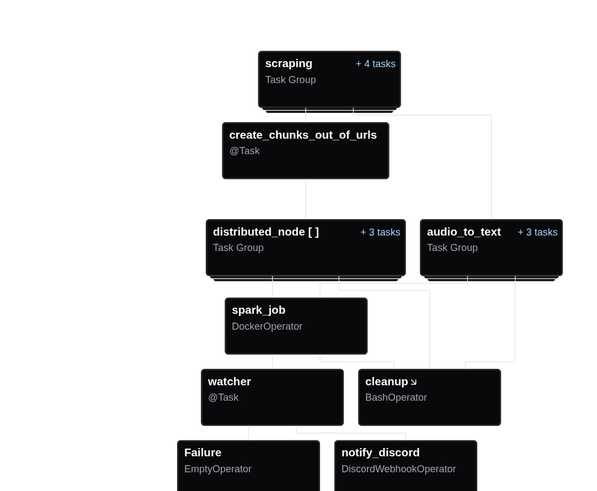
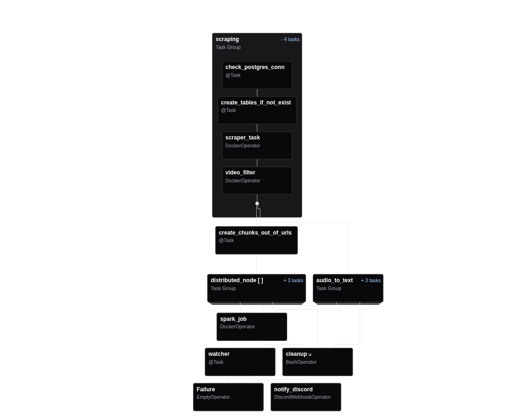
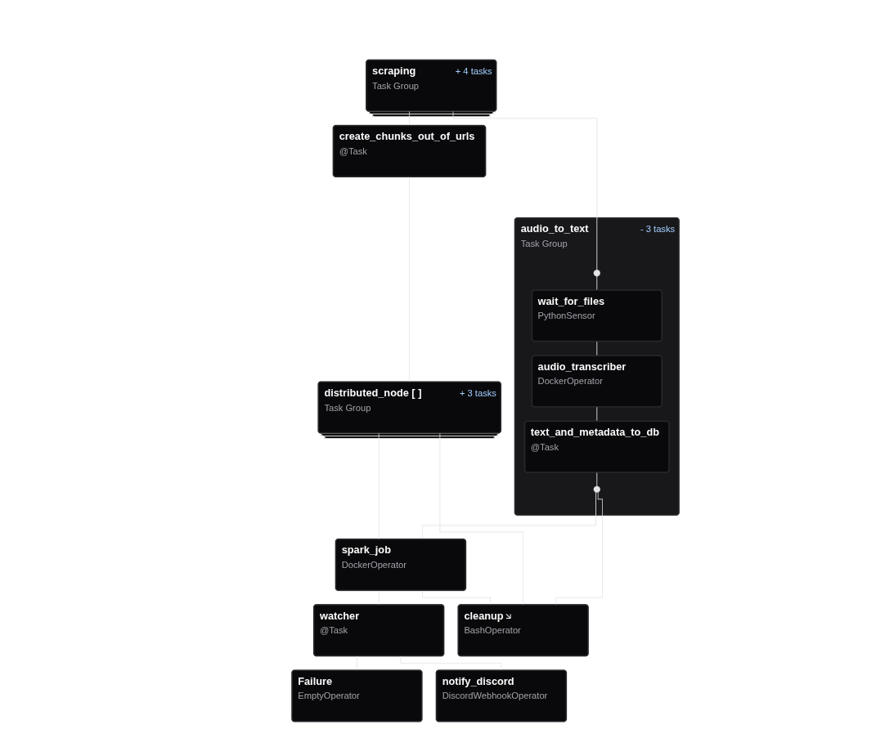
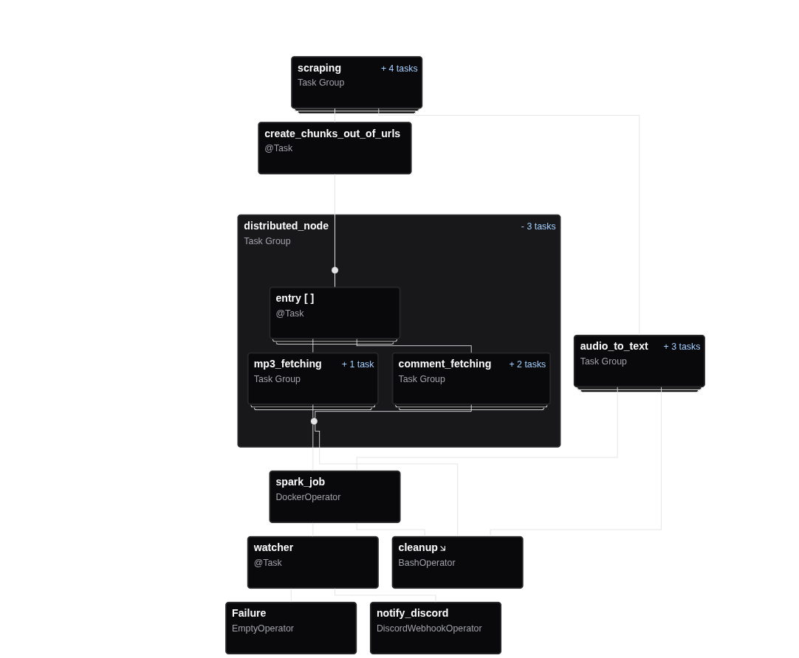

# YouTube Keyword-Based Sentiment Trend Analysis

This project is an end-to-end data pipeline built with **Apache Airflow**, designed to scrape YouTube video and comment data based on keywords, convert audio to text using Whisper, and analyze sentiment trends using Spark. The pipeline is fully containerized with Docker and designed to be run locally or adapted for cloud deployment.

---

## 📌 Key Features

- **Selenium**: For keyword-based YouTube video scraping.
- **Playwright**: For extracting and deduplicating YouTube comments.
- **yt-dlp**: For downloading audio and video metadata.
- **Whisper**: For transcribing audio to text.
- **text2emotion**: Applied to comments as a UDF inside Spark.
- **sumy**: Applied to transcribed audio for summarization via Spark UDF.
- Every major step is implemented as a **DockerOperator** task within Airflow.

---

## 🛠️ Technologies Used

- **Apache Airflow 3**
- **Docker**
- **Spark (via Docker)**
- **Selenium**
- **Playwright**
- **yt-dlp**
- **Whisper**
- **PostgreSQL**
- **Discord Webhook Notifications**

---

## 📊 DAG Structure Overview

### 1. Full DAG Overview

### 2. Scraping Logic

Includes DB checks, table creation, video scraping, and filtering.

### 3. Audio-to-Text Subpipeline

Waits for audio files, transcribes them via Whisper, and stores transcript and metadata in PostgreSQL.

### 4. Distributed Node Logic

Parallelized video chunk handling, comment + audio scraping, leading to Spark job for sentiment and summary processing.

---

## 🧱 Pipeline Breakdown

1. **Scraping Group**
    - Verifies PostgreSQL connection
    - Creates necessary tables
    - Scrapes YouTube videos using Selenium
    - Filters videos based on criteria

2. **Chunking**
    - Splits URLs into chunks for parallel processing

3. **Distributed Node**
    - **yt-dlp** for downloading `.mp3` and metadata
    - **Playwright** for comment extraction
    - All executed via DockerOperator tasks

4. **Transcription & Ingestion**
    - Uses **Whisper** to transcribe audio
    - Stores results and metadata in PostgreSQL

5. **Sentiment and Summary Analysis**
    - Spark UDFs:
        - `text2emotion` for comment sentiment
        - `sumy` for summarizing audio transcriptions

6. **Finalization**
    - Cleanup
    - Optional failure path
    - Notification sent via Discord webhook

---

## 🚀 Run Locally

To be added:  

- `docker-compose.yaml`  
- Airflow setup instructions  
- `.env.template`  
- Sample input

---

## 📬 Notifications

The DAG includes a DiscordWebhookOperator for alerting on job failure.

---

## 👤 Authors

- **Alexandros Andriopoulos** ([@letsiki](https://github.com/letsiki))  
- **Alexandros Koliousios** ([@user-al-kol](https://github.com/user-al-kol))

---

## 📜 License

MIT
