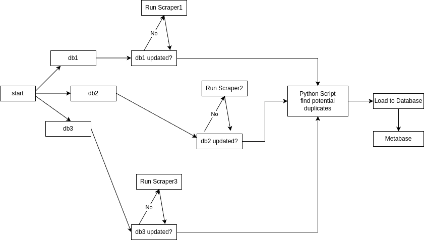

# bbd_project_roadmap
Planning for the upcoming BBD  project

- Potential project ideas:
  - telescope API's,  interferometry
  - business model emulation
 
- TODO:
  - (AA) Play around with free telescope API's
  - (AK) Contact A. Ritas for advice
  - (all) study Louloudis' [project](https://github.com/user-al-kol),
    particularly the 'tools and technologies used' section

(AA) Διαβασα λιγο τα desctiptions απο διαφορα API'S και μου φαινεται οτι
ισως και να μην ειναι πολυ καλη ιδεα τα τηλεσκοπια τελικα.  
Ο λογος ειναι οτι για να ενωσουμε sources και να βγαλουμε αξιολογα συμερασματα
θα χρειαστει αρκετη μελετη, η οποια θα ναι καπως ασχετη με αυτο που προσπαθουμε
να μαθουμε.  
Υπαρχουν πολλα ενδιαφεροντα API's αλλα μου φαινεται οτι ειναι πιο καταλληλα για 
stand alone χρηση και οτι δε θα καταφερουμε να εκμαιευσουμε κατι χρησιμο απο 
το συνδυασμο τους.  
(ΑΑ) Με αφορμη το selenium scraper που εφτιαξα για το kariera, σκεφτηκα το ενδεχομενο
να καναμε το ιδιο και για το linkedin και ισως ενα ακομα  
το DAG θα μπορουσε να ναι ως εξης:  
  
